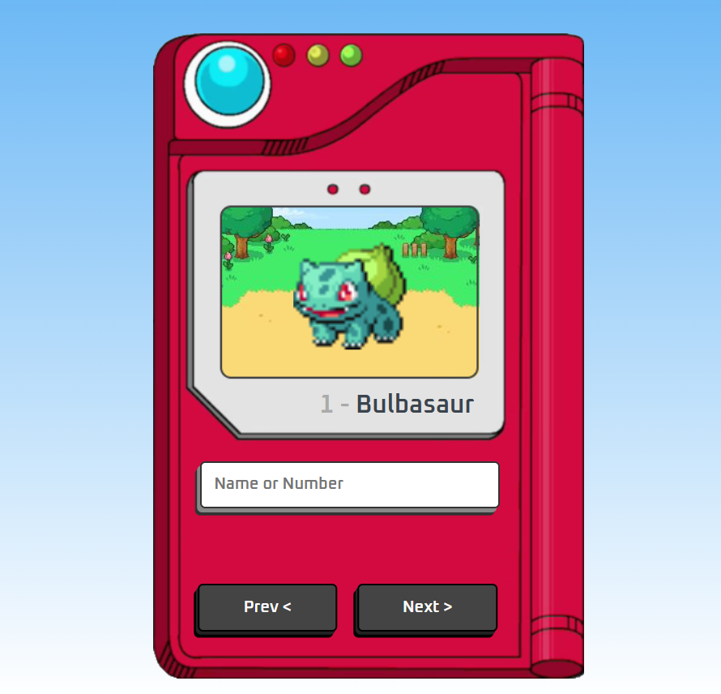

# Pokédex 

<p align="center">
  
</p>

## - A Pokédex, made using HTML, CSS and JavaScript. Project carried out through the YouTube video of the channel 'Manual Dev'. I did it to carry out my studies with these languages.

## - This project was made using data from an API(PokéAPI), in which I will leave the link here to be accessed if you want

## - PokéAPI LINK
````shell
https://pokeapi.co/
````
## - Copyright
- ALL COPYRIGHTS INTENDED FOR:
````shell
https://youtu.be/SjtdH3dWLa8?si=RNaEh_QQBH3ppZKW
````
## - Project
- Link to the visualization of the developed project:
````shell
https://diego-axel.github.io/Pokedex/
````
